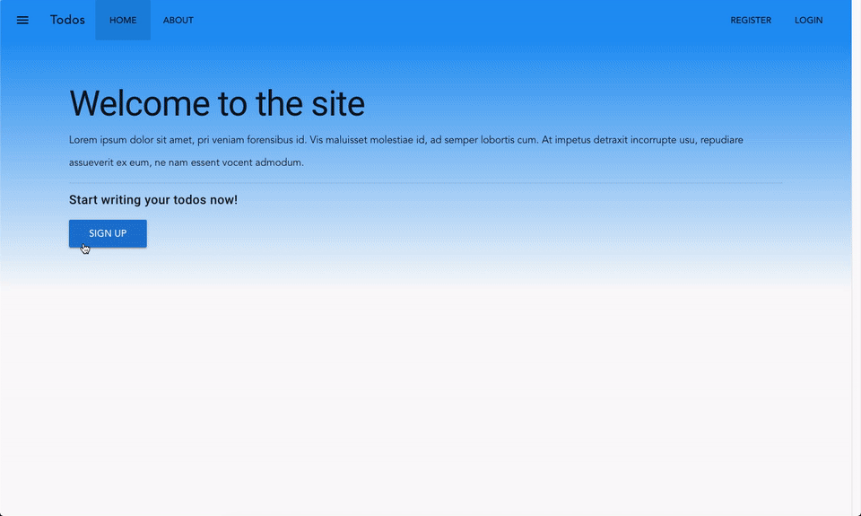

# Vue Todos front-end

This is a todo application made with Vue.js.

## Disclaimer

> The project started about 1 year ago (June 2018). Since then, Vue has changed a little, but specially the Vue CLI and my knowledge. Code may not be as clean as I'd like today, but it works. Same goes for the back-end.

## Inspiration

The app was developed using [this video](https://www.youtube.com/playlist?list=PLEhEHUEU3x5q-xB1On4CsLPts0-rZ9oos) as guidance.

Another site of interest is [todomvc](http://todomvc.com/), which is a compilation of examples of todo apps with various frameworks, Vue.js included. This app is inspired by this.

## Requirements

This app needs the accompanying server which is at [this repo](https://github.com/Maikuh/todo-vue-api). Setup this before running this app.

## Installation and Execution

0. Setup the back-end first
1. Clone the repo
1. Run `npm install` inside the directory
1. Run `npm run dev` for running locally or `npm run build` to generate static files and serve on another server
1. ...Profit?

### Demo

